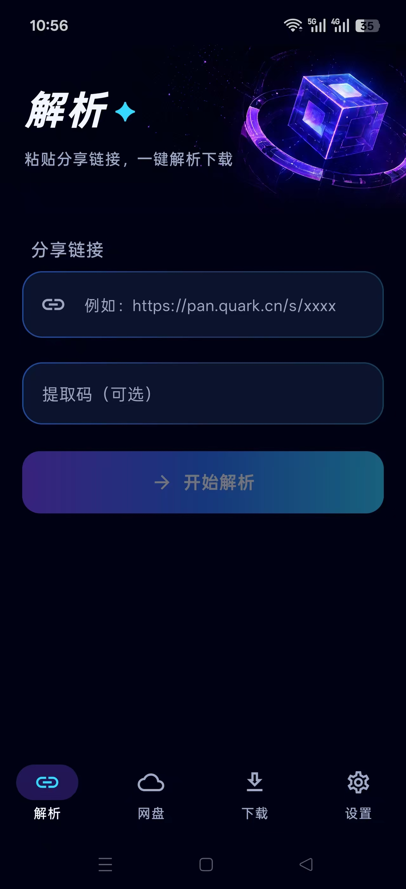
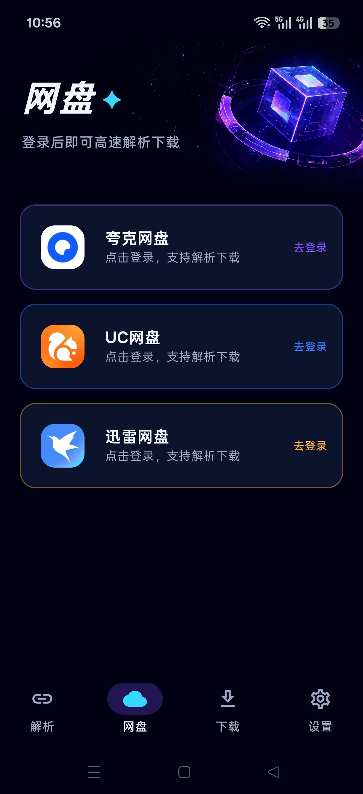
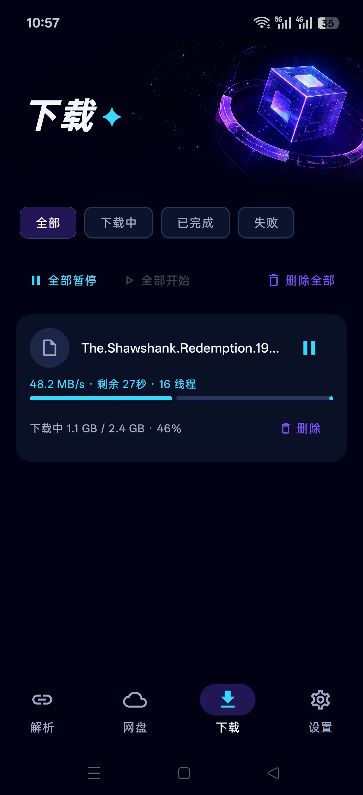

# YunLianAPP · 云链助手

Android 网盘下载工具，支持 **夸克、UC、迅雷网盘**，采用多线程分片下载。

## 功能

- 分享链接识别、解析，浏览分享文件和文件夹
- 夸克、UC、迅雷网盘登录与账号管理
- 多线程 Range 分片下载、断点续传、暂停和继续
- 下载任务管理、实时进度与速度显示
- 下载速度最高可达约 **50 MB/s**；实际速度取决于网络、设备、文件与网盘服务，截图显示 **48.2 MB/s**

## 下载

当前版本：**1.0.2**（versionCode 3）。

[下载 YunLianAPP 1.0.2 安装包](https://github.com/2857865859/YunLianAPP/releases/download/v1.0.2/YunLianAPP-1.0.2.apk) · [查看发布说明](https://github.com/2857865859/YunLianAPP/releases/tag/v1.0.2)

## 应用截图

<table>
<tr><th>分享链接解析</th><th>网盘账号</th><th>分片下载</th></tr>
<tr>
<td></td>
<td></td>
<td></td>
</tr>
</table>

## 公开源码范围

`client/` 包含客户端界面、网盘接口、账号管理、分片下载、任务持久化和相关测试的源码快照。

为保护私有实现，省略了 SoftwareHub 后台接口、验证码与授权模块、关联启动入口及测试、正式鉴权配置、应用签名构建配置、签名文件、密钥和私有 Git 历史。第三方鉴权常量已留空。

**这是部分源码，不能直接构建完整应用，也不代表安装包的完整对应源码。** 网盘登录所需的平台验证界面仍属于客户端功能，后台每日验证码实现不在公开范围内。

## 来源与许可证

基于 [CYQawa/YunX](https://github.com/CYQawa/YunX) 修改，衍生源码保留原项目的 [AGPL-3.0 许可证](LICENSE)。本次快照整理日期：2026-10-06。